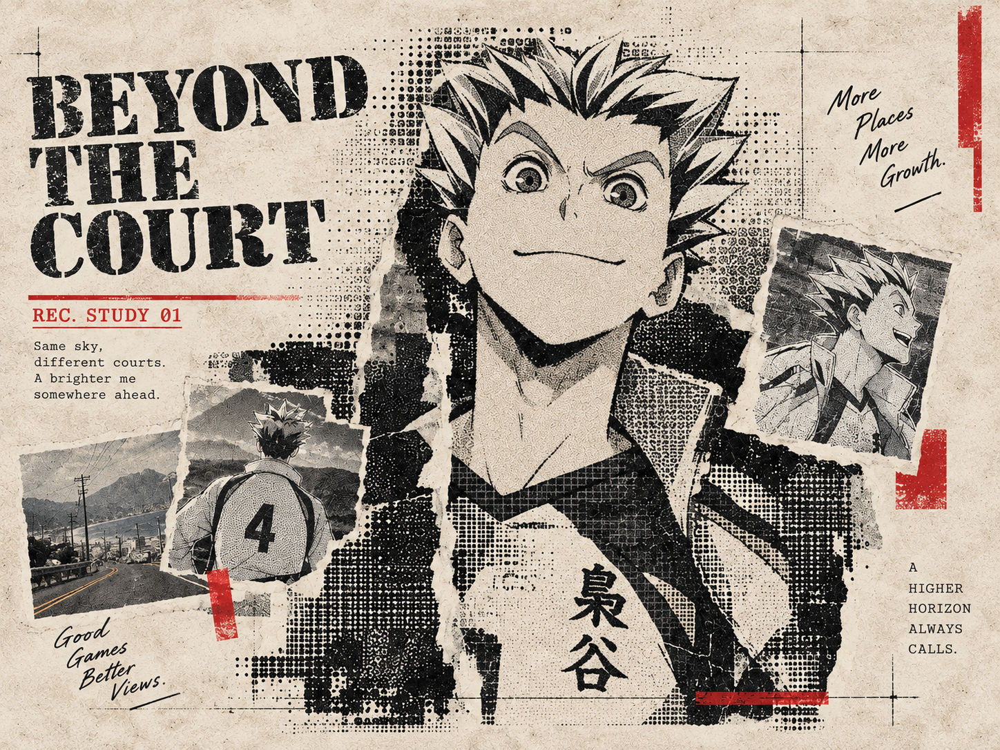
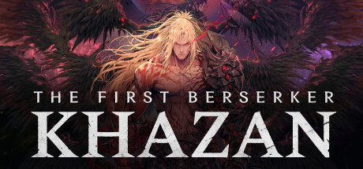
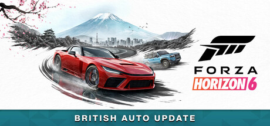
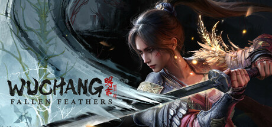
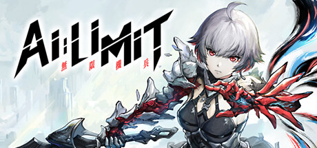
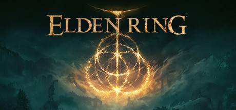
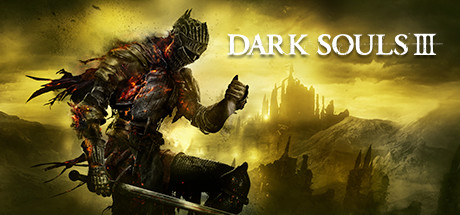

# Hi, I'm Euan Zhu (yunfeizhu) 👋

- 👨‍💻 I'm an **AI full-stack developer** with a focus on **frontend development**.
- 🛠️ I work with **Vue and React** on the frontend, and **Node.js and Python** across the stack.
- 🤖 I'm interested in building **AI applications** and **developer tools**.
- 🌱 I contribute to **open source** through bug fixes, regression tests, and localization.
- 🔍 I enjoy **tracking down bugs** and understanding how things work.
- 🎮 My favorite game genres are **Soulslikes and JRPGs**.
- 🏐 I'm a fan of **sports anime** with plenty of **passion and team spirit**.
- 🎨 I enjoy experimenting with **AI-generated content (AIGC)**.

**Languages and Tools:**

 &nbsp;  &nbsp;  &nbsp;  &nbsp;  &nbsp;  &nbsp;  &nbsp;  &nbsp; 

## Gaming 🎮

<table>
<tr>
<td width="230" align="center" valign="top">
   
  <strong>The First Berserker: Khazan</strong> 
  🟢 Now playing
</td>
<td width="230" align="center" valign="top">
   
  <strong>Forza Horizon 6</strong> 
  Previously played
</td>
<td width="230" align="center" valign="top">
   
  <strong>WUCHANG: Fallen Feathers</strong> 
  Previously played
</td>
<td width="230" align="center" valign="top">
   
  <strong>AI LIMIT</strong> 
  Previously played
</td>
</tr>
</table>

<table>
<tr>
<td width="230" align="center" valign="top">
   
  <strong>Black Myth: Wukong</strong> 
  Previously played
</td>
<td width="230" align="center" valign="top">
   
  <strong>Lies of P</strong> 
  Previously played
</td>
<td width="230" align="center" valign="top">
   
  <strong>Elden Ring</strong> 
  Previously played
</td>
<td width="230" align="center" valign="top">
   
  <strong>Dark Souls III</strong> 
  Previously played
</td>
</tr>
</table>

## Statistics 📊

  
  &nbsp;
  

## Open Source Contributions 🤝

<!-- CONTRIBUTIONS:START -->

| Project | Contribution | Pull request | Status |
| --- | --- | :---: | :---: |
| **[antdv-next](https://github.com/antdv-next/antdv-next)** | fix(table): keep initially selected records in rowSelection.onChange across pages | [#881](https://github.com/antdv-next/antdv-next/pull/881) |  |
| **[pptx-viewer](https://github.com/ChristopherVR/pptx-viewer)** | docs(site): add simplified chinese documentation | [#284](https://github.com/ChristopherVR/pptx-viewer/pull/284) |  |
| **[pptx-viewer](https://github.com/ChristopherVR/pptx-viewer)** | feat(i18n): export locale subpaths from viewer packages | [#283](https://github.com/ChristopherVR/pptx-viewer/pull/283) |  |
| **[pptx-viewer](https://github.com/ChristopherVR/pptx-viewer)** | Add a Simplified Chinese reference locale. | [#281](https://github.com/ChristopherVR/pptx-viewer/pull/281) |  |
| **[pptx-viewer](https://github.com/ChristopherVR/pptx-viewer)** | Localize inspector and ribbon controls. | [#279](https://github.com/ChristopherVR/pptx-viewer/pull/279) |  |
| **[pptx-viewer](https://github.com/ChristopherVR/pptx-viewer)** | Prevent an older PPTX load from overwriting the current deck. | [#243](https://github.com/ChristopherVR/pptx-viewer/pull/243) |  |
| **[virtua](https://github.com/inokawa/virtua)** | Fix viewport measurement for fixed-position containers. | [#965](https://github.com/inokawa/virtua/pull/965) |  |
| **[FastMCP](https://github.com/punkpeye/fastmcp)** | Preserve additional properties in tool output schemas. | [#373](https://github.com/punkpeye/fastmcp/pull/373) |  |
| **[MCPHub](https://github.com/samanhappy/mcphub)** | Keep on-demand servers alive until running tools finish. | [#1164](https://github.com/samanhappy/mcphub/pull/1164) |  |

<!-- CONTRIBUTIONS:END -->

[View all merged PRs to external projects →](https://github.com/search?q=is%3Apr+is%3Amerged+author%3Ayunfeizhu+is%3Apublic+-user%3Ayunfeizhu&type=pullrequests)
